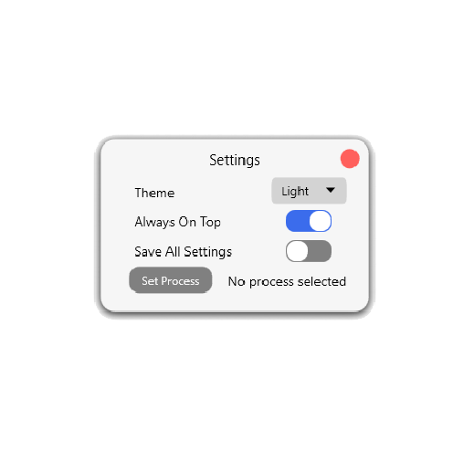

# Alpha Clicker 1.4

Welcome to Alpha Clicker 1.4! This update brings a host of exciting new features and improvements designed to enhance your user experience. Below is a detailed overview of the new features included in this release.

**Reminder** This is not the original program, it is created as an update based on user feedback on https://github.com/robiot/AlphaClicker

## New Features

### 1. New Theme System
The theme system has been completely revamped. The new dynamic theme manager now allows for easy integration of user-created themes, along with four stock themes: Light, Dark, Nature, and Undecided. 

- **Adding Custom Themes:** To add your own themes, simply place them in the `User Themes` folder within the application directory. Creating themes is straightforward: duplicate the `BaseThemeTemplate.xaml` file and open it with a text editor to customize.

**Theme Files** are easy to both create and understand. Everything that needs to be done is change the HEX colors. Be mindful of not deleting other stuff since it will break.

### 2. Mouse Click Holding Option
You can now select "Hold Mouse Click" from the dropdown menu of click types.

### 3. Revamped Settings System
The settings menu has been significantly improved. The new system allows you to save all settings, so you won’t need to reconfigure them each time. Additionally, themes and "Top Most" settings now save independently of the "Save All Settings" function.

### 4. Process Selecting
A new feature in the settings menu, "Process Selecting," allows you to enable clicking only within a specific application. This means you can toggle clicking on, minimize the application, and use your computer normally without interruption.

## Additional Changes

- **Visual Feedback:** Minimal visual changes have been made to enhance feedback on whether clicking is active.
- **Improved Keybind Selection:** The settings revamp includes an improved keybind selection for a better user experience.

## More can potentially be added before release
I have no idea what i might end up doing maybe i get bored, maybe not, the features on this list at least will be released in the coming days, just need to clean up the code a little first.

## Installation

To update to Alpha Clicker 1.4, download the latest version from the release **Not Released Yet**

This update is the result of being bored for a weekend. I do not promise to continue updating nor expect anyone to see this. It was created as a fun weekend project based on implementing user suggestions from https://github.com/robiot/AlphaClicker/issues. If there are anything else that is wanted then you can message me. My dms are always open (i think). Have a good day (or night).

